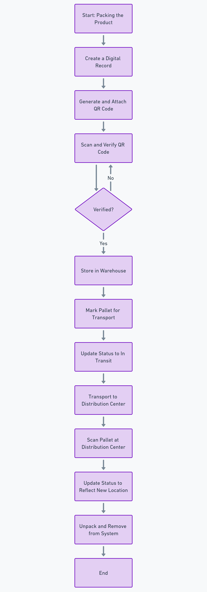

# Digitalization of Storage and Transport Processes

## Overview

This application was developed to digitalize the processes of product storage and transport in **Polo Čačak doo**, a company specializing in the processing of fruits and vegetables. The goal is to improve inventory tracking in warehouses and distribution centers through a cost-effective, serverless software solution using Firebase and an Android client application.

---

## Key Features

### 1. Pallet Management
- Users can create a digital version of a pallet after packing products.
- Each pallet includes:
  - Product type
  - Number of packages
  - Creation date (auto-generated)
  - Creator's name (logged-in user)
  - Unique identifier (auto-generated)
  - Status (`Created`, `Ready`, `In Transit`)
  - Assigned warehouse

### 2. QR Code Integration
- Generate and attach a QR code for each pallet.
- QR codes uniquely identify pallets and streamline tracking during transport and storage.

### 3. Pallet Status Tracking
- Users can scan QR codes to:
  - Mark pallets as `Ready` for the next phase.
  - Transition pallets between statuses such as `In Transit` or `Unpacked`.
- Pallets that are not verified cannot be transported, ensuring accuracy and completeness.

### 4. Real-Time Inventory Insights
- Displays a list of verified pallets, grouped by warehouse and product type.
- Provides quick insights into the number of pallets and their details per location.

### 5. Transport and Unpacking Workflow
- Simplified transport process:
  - Scan QR code to mark pallets for transport.
  - Change pallet status via swipe gestures to confirm transitions (e.g., `In Transit`, `Unpacked`).
- Prevents errors by ensuring that only verified pallets can enter transport mode.

---

## Technologies Used

### Backend and Infrastructure
- **Firebase (Serverless):**
  - **Firestore:** Firestore database for structured data storage.
  - **Authentication:** Secure user login using phone numbers.
  - **Cloud Functions:** Automates backend logic such as notifications and data synchronization (TBD).
  - **Firebase Messaging:** Sends real-time push notifications (TBD).

### Frontend
- **Android Application:**
  - Built with **Kotlin** and **MVVM Architecture** for modular, maintainable, and testable code.
  - Uses **Jetpack Compose** for modern UI development.
  - Relies on **Kotlin Coroutines** for managing data changes and asynchronous operations efficiently.

---

## User Authentication
- Registration and login via phone number for simplicity and security.
- OTP (One-Time Password) verification ensures secure access.
- User details (name and role) are recorded and linked to pallet creation and tracking.

---

## Backoffice System
- **Firebase Console** is used for administrative tasks:
  - Adding and modifying products.
  - Managing warehouses and users.
  - Direct access to Firestore for data adjustments.

---

## Future Enhancements

### 1. Detailed Product Tracking
- Add support for tracking products after pallets are unpacked.
- Display individual product quantities at each warehouse.

### 2. Raw Material and Consumable Management
- Track materials used per product unit.
- Implement low-stock alerts to improve supply chain efficiency.

---

## Conclusion

This application digitalizes the product storage and transport processes, providing real-time tracking and minimizing manual effort. It integrates seamlessly with Firebase, ensuring scalability and low maintenance costs.

